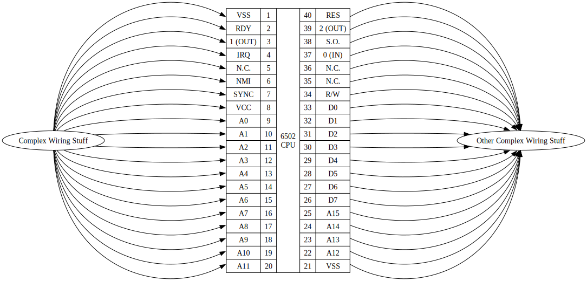
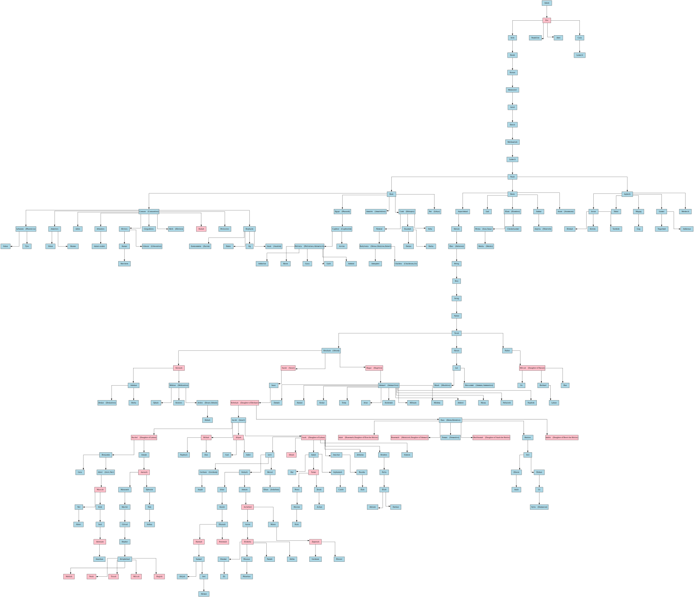
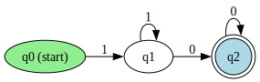

# graph

<!-- Include the three diagrams in the assets folder -->
<div align="center">
  <p float="left">
    <!-- 
     -->
    
  </p>
  <p float="left">
    
    
  </p>
  <!-- [***Here's a link to the online compiler playground!***](https://adam-mcdaniel.net/sage)
  [***Here's a link to the online compiler playground!***](https://adam-mcdaniel.net/sage) -->
</div>

- **Author**: Adam McDaniel
- **GitHub**: [adam-mcdaniel/graph](https://github.com/adam-mcdaniel/graph)
- **License**: MIT

Graph is a powerful and flexible Graphviz interface library for Rust, designed to simplify the creation and visualization of complex graphs. Whether you're visualizing computer architectures, family trees, finite automata, or any other interconnected systems, graph provides an intuitive API to bring your diagrams to life.

## Table of Contents

- [About](#about)
- [Features](#features)
- [Usage](#usage)
  - [Installation](#installation)
  - [Creating a Simple Graph](#creating-a-simple-graph)
  - [Building Complex Diagrams](#building-more-complex-diagrams)
- [About the Author](#about-the-author)
- [Documentation](#documentation)
- [License](#license)

## About

Graph is a Rust library that provides a seamless interface to Graphviz, enabling developers to programmatically create, manipulate, and visualize graphs with ease. Whether you're a systems engineer, computer scientist, or hobbyist, graph offers the tools you need to represent complex relationships and structures visually.

Key applications include:

- **System Architecture Diagrams**: Visualize components and their interactions within a system.
- **Automata Theory**: Create state machines, finite automata, and more.
- **Family Trees**: Map out genealogical relationships.
- **Network Topologies**: Design and represent computer networks.
- **Educational Tools**: Illustrate concepts in computer science, mathematics, and other fields.

## Features

- **Intuitive API**: Easily create nodes, edges, and records with a fluent interface.
- **Graphviz Property Support**: Customize graphs with various Graphviz attributes like `rankdir`, `splines`, `nodesep`, and more.
- **Record Structures**: Define complex node structures using records for detailed representations.
- **SVG Output**: Generate scalable vector graphics (SVG) for high-quality visualizations.
- **Extensible**: Integrate seamlessly with other Rust projects and extend functionality as needed.
- **Error Handling**: Robust error messages and handling to guide you through graph creation.

## Usage

### Installation

Add graph to your `Cargo.toml`:

```toml
[dependencies]
graph = { git = "https://github.com/adam-mcdaniel/graph" }
```

### Creating a Simple Graph

Here’s a basic example of how to create a simple graph with two nodes and an edge between them:

```rust
use std::path::Path;
use graphviz_rs::{Graph, ID};

fn main() {
    let mut g = Graph::new()
        .with_property("rankdir", "LR"); // Left to Right layout

    let node_a = g.new_node("A")
        .with_property("label", "Node A")
        .finalize();

    let node_b = g.new_node("B")
        .with_property("label", "Node B")
        .finalize();

    g.new_edge(node_a, node_b)
        .with_property("label", "A to B")
        .finalize();

    g.build_svg(&Path::new("simple_graph.svg"));
}
```

### Building More Complex Diagrams

Here's a visualization of the 6502 CPU architecture using graph:

```rust

fn cpu_6502_diagram() {
    let mut g = Graph::new()
        .with_property("rankdir", "TB")
        .with_property("nodesep", "0.5")
        .with_property("layout", "fdp");

    let cpu = g.new_record("CPU_6502", 5, 20)
        .insert(2, 0, "6502\\nCPU")
        .insert(1, 0, "1")
        .insert(1, 1, "2")
        // ...
        .insert(4, 19, "VSS")
        .finalize();
    
    let a = g.new_node("Complex Wiring Stuff")
        .with_property("label", "Complex Wiring Stuff")
        .with_property("pos", "-6,0!")
        .finalize();
    let b = g.new_node("Other Complex Wiring Stuff")
        .with_property("label", "Other Complex Wiring Stuff")
        .with_property("pos", "6,0!")
        .finalize();

    for y in 0..20 {
        g.new_edge(cpu[4][y], b)
            .finalize();

        g.new_edge(a, cpu[0][y])
            .finalize();
    }

    g.build_svg(&Path::new("cpu_6502.svg"));
}
```

## About the Author

[I'm a computer science PhD student](https://adam-mcdaniel.net) at the [University of Tennessee, Knoxville🍊](https://www.youtube.com/watch?v=-8MlEo02u54). Rust is my favorite language, and [I've](https://github.com/adam-mcdaniel/sage) [written](https://github.com/adam-mcdaniel/oakc) [many](https://github.com/adam-mcdaniel/harbor) [other](https://github.com/adam-mcdaniel/tsar) [programming](https://github.com/adam-mcdaniel/free) [languages](https://github.com/adam-mcdaniel/xasm).

I'm always looking for new projects to work on, so if you have an idea for a project or a collaboration, feel free to reach out to me or join me on the [Sage Discord server](https://discord.gg/rSGkM4bcdP)!

## Documentation

For more information on how to use Graph, see the [documentation](https://adam-mcdaniel.github.io/graph/).

## License

This project is licensed under the MIT License - see the [LICENSE](LICENSE) file for details.
